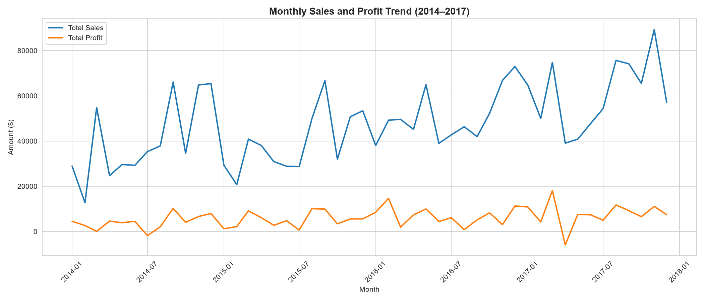
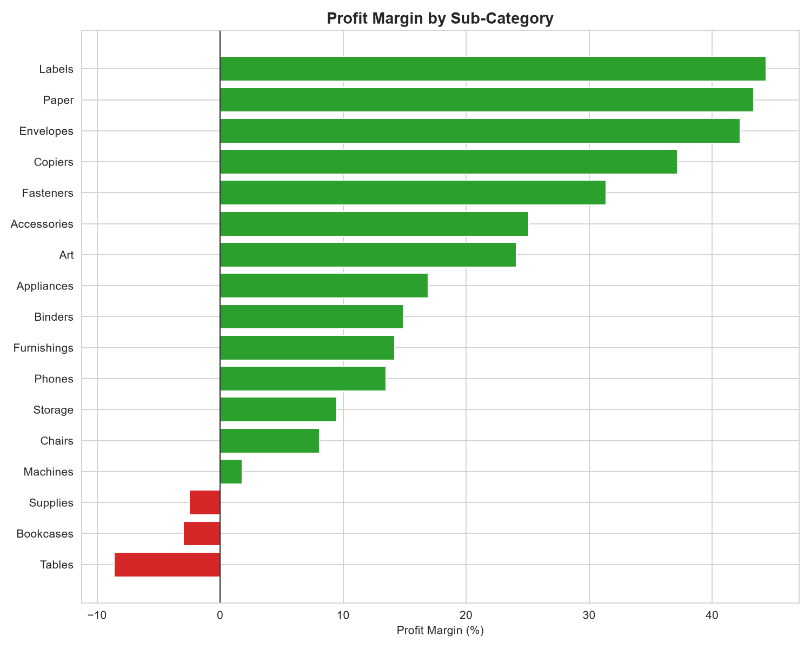
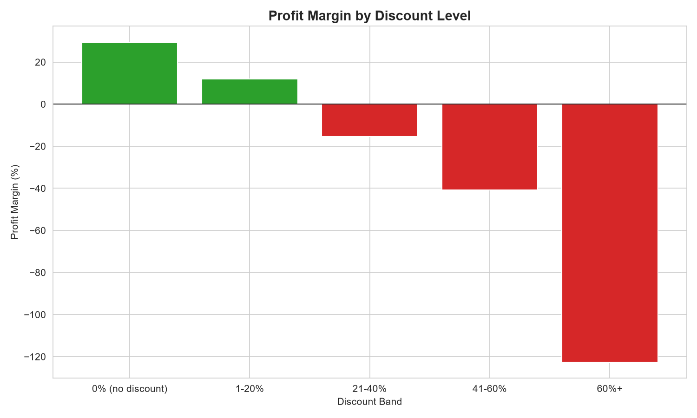
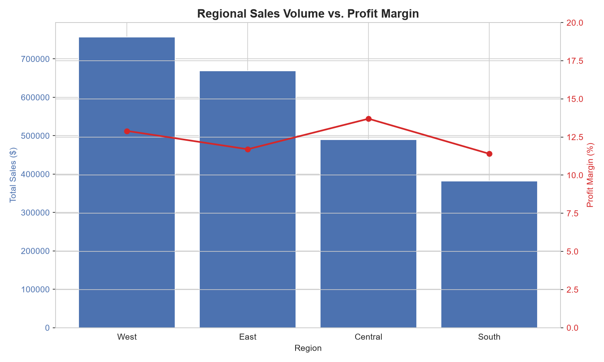

# Retail Sales Analysis — SQL & Python

End-to-end analysis of retail sales data using PostgreSQL and Python — from raw, messy CSV to a normalized relational database and business insights.

## Overview

This project takes a raw retail sales dataset and walks through a full data analyst workflow:

- Designing and building a normalized PostgreSQL database from a single flat CSV
- Cleaning and transforming inconsistent, real-world data (mixed date formats, denormalized structure)
- Writing SQL to answer business questions (top products, regional performance, trends)
- Using Python (pandas, matplotlib/seaborn) for deeper analysis and visualization

## Tech Stack

- PostgreSQL 18
- SQL (DDL, DML, joins, window functions, regex, type casting)
- Python (pandas, matplotlib/seaborn)
- Git / GitHub

## Dataset

Sample Superstore dataset — see [`data/README.md`](data/README.md) for the download link and setup instructions.

## Project Structure

├── data/ # dataset (not committed) + source documentation
├── sql/ # schema creation, ETL, and analysis SQL scripts
├── notebooks/ # Python analysis notebook
├── images/ # exported charts
├── docs/ # detailed process log and design decisions
└── README.md

## Approach

**1. Staging** — loaded the raw CSV as-is into a `staging_sales` table (all TEXT columns) to avoid failures from inconsistent formatting before any cleaning happened.

**2. Schema design** — normalized the flat file into four related tables following a simple star-schema pattern:

- `customers` — dimension table (customer_id, segment, home location)
- `products` — dimension table (product_id, name, category, sub-category)
- `orders` — order-level info (dates, shipping)
- `order_items` — fact table (sales, quantity, discount, profit per line item)

**3. Transform & load** — cleaned and cast data types (especially dates) while moving data from staging into the normalized schema.

**4. Analysis** — SQL queries for business insights, extended with Python for visualization.

## Key Challenges & Design Decisions
A few real data-quality issues came up during this project — full details in [`docs/PROCESS_LOG.md`](docs/PROCESS_LOG.md):
- **Inconsistent date formats** in the same column (`DD-MM-YYYY` mixed with `M/D/YYYY`), solved with a staging table + conditional `TO_DATE()` casting
- **pgAdmin's Import wizard generated incorrect COPY syntax**, breaking on embedded apostrophes — solved by writing `\copy` manually via psql
- **Modeling decision**: treated customer location as a fixed home address rather than per-order shipping destination, for simplicity

## Key Insights

**1. Revenue ≠ Profitability.** Several top-10 products by revenue are barely profitable or losing money — e.g. Cisco TelePresence System (-8.0% margin) and GBC DocuBind P400 (-10.5% margin) — despite being among the highest earners by sales volume.

**2. Discounting has a clear profitability breaking point.** Profit margin decays sharply as discount level rises: from +29.5% margin at 0% discount, down to -15.3% once discounts exceed 20%, and as low as -122.6% at 60%+ discount.

**3. Furniture is a category-wide problem, not just isolated products.** Tables (-8.6% margin, -$17.7K) and Bookcases (-3.0% margin, -$3.5K) are loss-making sub-categories. In contrast, Labels (44.4%), Paper (43.4%), and Copiers (37.2%, on $149K revenue) are standout high-margin performers.

**4. Steady growth with strong seasonality.** Monthly revenue grew from roughly $392K in 2014 to $674K in 2017. Sales consistently spike in September, November, and December each year — November 2017 was the single strongest month in the dataset (213 orders, $89.3K in sales), consistent with back-to-school and holiday retail patterns.

**5. Regional performance is balanced.** All four regions are profitable (11.4%–13.7% margin). West leads in raw sales, but Central converts revenue to profit most efficiently.

**6. The highest-revenue customer was actually losing the business money — and it led to the root cause.** Among the top 10 customers by spend, `SM-20320` generated the most revenue ($25,043) but the *only* negative profit (-$1,981), while others like `TC-20980` posted strong margins (47%). Investigating both this customer and an unprofitable month (April 2017) traced back to the same pattern: individual big-ticket Technology products (3D printers, TelePresence systems, laser printers) sold at 50-70% discounts. A single Cisco TelePresence System sale at 50% off, for example, alone accounted for one customer's entire lifetime loss, despite all their other purchases being profitable.

**Overall narrative:** This business is fundamentally healthy — solid revenue growth, balanced regional performance, and several genuinely high-margin categories. Its profitability problems are not broad or structural, but traceable to a specific, correctable pattern: steep discounting (50%+) on individual high-value Technology products. A targeted discount cap or approval threshold on big-ticket Technology items would likely resolve most of the loss-making transactions identified in this analysis.

## Visualizations

### Monthly Sales & Profit Trend

Revenue grew steadily from 2014 to 2017, with consistent seasonal spikes each September, November, and December — November 2017 was the strongest month in the dataset.

### Profit Margin by Sub-Category

Tables, Bookcases, and Supplies are the only loss-making sub-categories, with Tables representing the single largest dollar loss. Labels, Paper, and Envelopes are the strongest performers by margin.

### Profit Margin by Discount Level

Profit margin declines sharply as discount level increases, turning negative once discounts exceed roughly 20-40% — a clear, actionable pricing threshold.

### Regional Sales Volume vs. Profit Margin

West leads in raw sales volume, but Central achieves the highest profit margin — showing that sales volume and profitability don't always move together.

## Setup / How to Run

1. Clone this repo
2. Download the dataset (see `data/README.md`) and place it in `data/`
3. Create a PostgreSQL database
4. Run the SQL scripts in `sql/` in order (01 → 06)
5. Open `notebooks/` for the Python analysis
